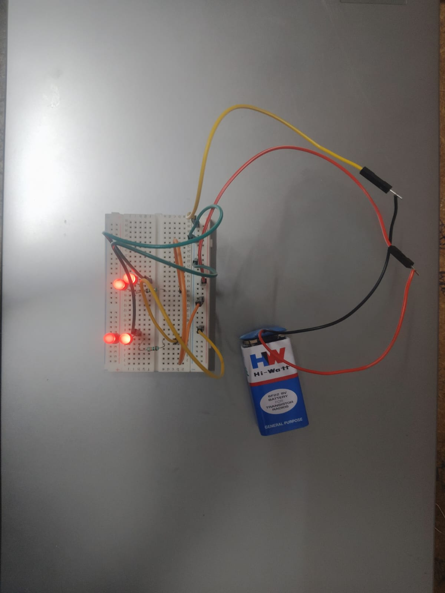

Comparison of LED brightness and current flow in series and parallel connections using Arduino UNO and a 9V battery.
# Series vs Parallel LED Connections

## Circuit Connection

## Description

Comparison of LED brightness and current flow in series and parallel connections using Arduino UNO and a 9V battery.
