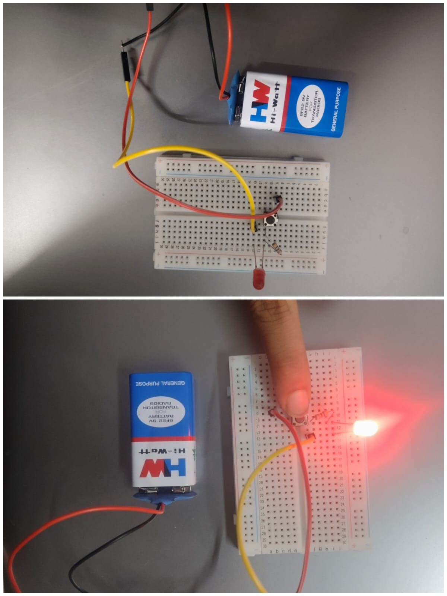

# Push Button Controlled LED

## Circuit Connection

## Description

Control of an LED using a push button switch. This experiment demonstrates digital input reading and basic switch interfacing with Arduino UNO.
